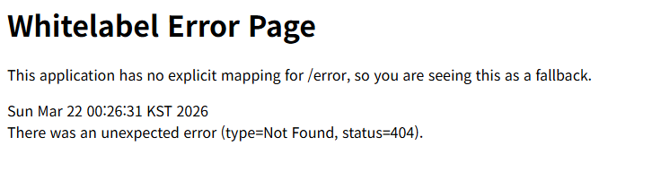

 

URL이 웹사이트의 주소를 나타낸다는 것은 알고 있었으나, Host, Port, Path, Query처럼 다양한 요소들로 나뉜다는 것을 알게 되었다.  
 또한 원래는 HTTP 요청 및 응답에서 body가 무엇을 하는지는 대략적으로 알고 있었으나, headers는 무슨 의미가 있는 지 모르는 상태로 그냥 AI가 시키는 대로 따라 썼었다.  
 그러나 이번 활동을 통해 headers 및 status line이 무슨 역할을 하는 지를 명확하게 알 수 있었으며, 이후의 프로젝트 개발 활동에 크게 도움이 될 것 같다는 생각이 들었다.  
 REST API에 대해서는 이번 기회를 통해 처음 알게 되었는데, 앞에 있는 REST의 의미를 알고 나니 나도 REST API를 썼다는 것을 알게 되어 놀랐다.  
 또한 원래는 Python을 백엔드로 사용했었는데, 이번 기회를 통해 Java Backend도 배울 수 있을 것 같아 몹시 기대된다.

# API 명세서

## 상품 기능

### 상품 정보 등록
HTTP Method : POST  
URL : /items  
### 상품 목록 조회
HTTP Method : GET  
URL : /items  
### 개별 상품 정보 상세 조회
HTTP Method : GET  
URL : /items/{itemId}  
### 상품 정보 수정
HTTP Method : PATCH  
URL : /items/{itemId}  
### 상품 삭제
HTTP Method : DELETE  
URL : /items/{itemId}  
## 주문  기능
### 주문 정보 생성
HTTP Method : POST  
URL : /orders  
### 주문 목록 조회
HTTP Method : GET  
URL : /orders  
### 개별 주문 정보 상세 조회
HTTP Method : GET  
URL : /orders/{orderId}  
### 주문 취소
HTTP Method : PATCH  
URL : /orders/{orderId}  