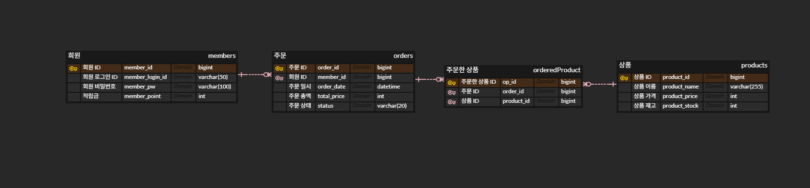
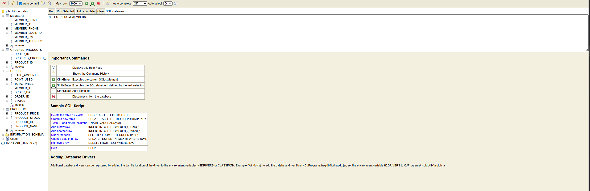
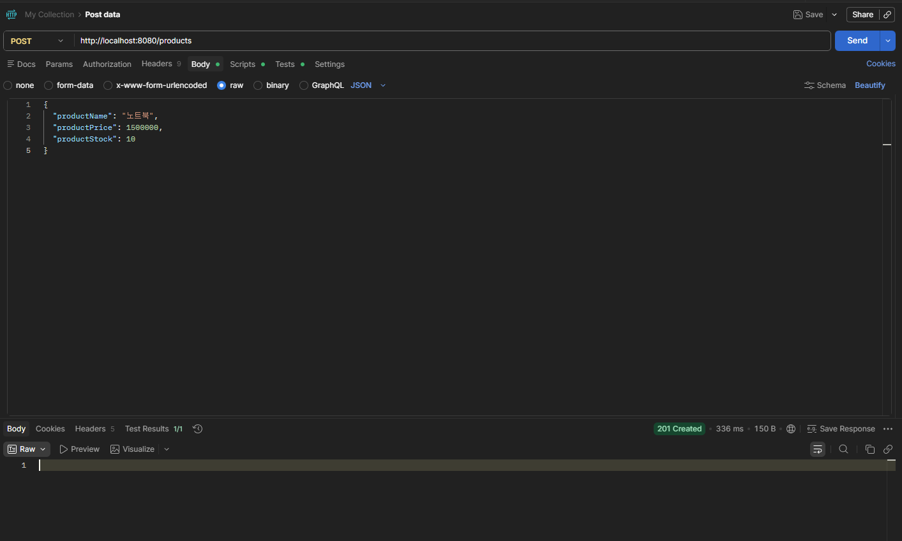
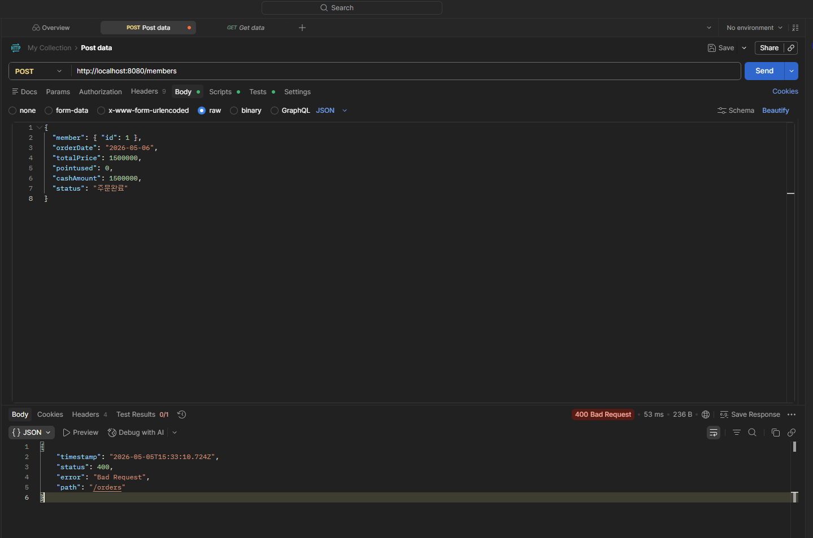

 해당 그림은 백엔드 데이터베이스의 ERD 다이어그램이다.  

 해당 그림은 H2 데이터베이스를 보여준다.  

 해당 그램은 성공적으로 products 테이블에 데이터를 추가한 것이다.  

 해당 그림은 orderDate를 LocalDateTime이 아닌 날짜만 보내 400 에러가 발생했다.  

확실히 지난 번보다 많은 것들이 추가되었고 어려웠지만, 그래도 지난 수업들을 통해 배운 것들 덕분에 예상보단 쉽게 제작할 수 있었다.  
확실히 지난 시간까지는 실제로 API를 테스트할 수 없어 프로젝트는 만드는 데에 있어서 크게 재미가 없었지만, 이번 시간부터 API를 POSTMAN을 통해 실제로 테스트할 수 있다 보니 더 프로젝트에 관심이 가는 것 같다.  

이번 시간에는 데이터베이스 구조를 ERD 다이어그램으로 표현하는 법을 배웠으며, 1:1, 1:N, N:M 관계에 대해서도 배웠는데, N:M 관계에서는 중간에 하나의 테이블이 필요하다는 것을 보고
처음에는 왜 필요한지 이해가 가지 않았지만, 실제로 ERD 다이어그램을 그려보니 왜 필요한지 알 수 있었다.  

